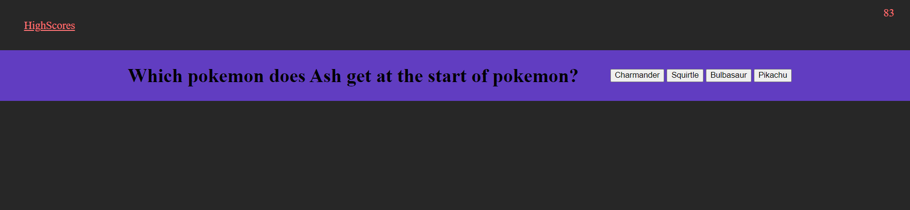
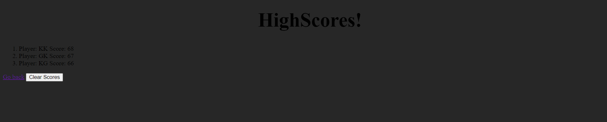

# CodeQuiz - Web API

## My Task

During my Full-Stack coding journey I need to know how to create interactive coding challenges. This assessment is a multiple-choice quiz. On the way to becoming a Full-Stack Web Developer this type of challenge will likely prepare me for coding or questions that may come up during the interview process.

This task allowed me to step into building a timed coding quiz that will run in the browser using HTML CSS and JavaScript written code that will have a responsive user interface.

## User Story

```
AS A coding BootCamp student
I WANT to create a fun interactive timed quiz 
on classic animated characters
SO THAT I can see who is the most knowledgeable on the subject
```

## Acceptance Criteria

```
GIVEN I am creating a fun quiz
WHEN I click the start button
THEN a timer starts and I am presented with a question
WHEN I provide an answer it will proceed to another question
WHEN I answer incorrectly the time will then subtract from the clock
When all questions are answered or the timer reaches 0
THEN the game is over
WHEN the game is over I can save my initials and my score
```

## Mock-Up

The following animation demonstrates the application functionality that was given to me as a guide to for the development phase:


## Review 

The following has been placed here to meet requirements for review:


Refer to this link [Deployed Application](https://thekhalidgibson.github.io/CodeQuiz/) to view and explore the application and functions on the deployed site on a live URL

Refer to this link [GitHub Repository](https://github.com/TheKhalidGibson/CodeQuiz) to view and explore the GitHub repo for this assignment


## Screenshots

The following images reflect the functionality and final results of development for this deployed application:

This is an image showing the Start page of my Code Quiz


This is an image showing the Questions of my Code Quiz


This is an image showing the HighScores page of my Code Quiz
